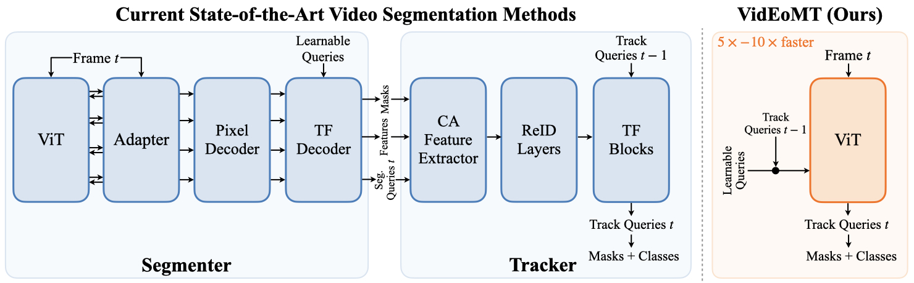
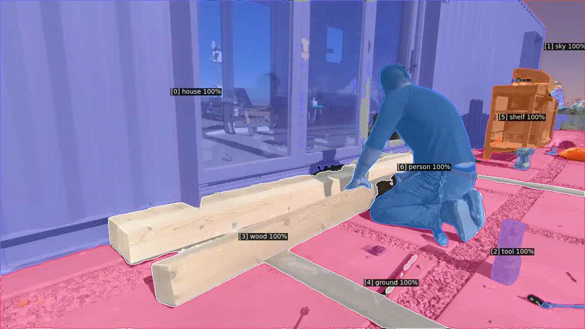

## VidEoMT: Your ViT is Secretly Also a Video Segmentation Model
**CVPR 2026** · **[📄 Paper](?)**

**[Narges Norouzi](https://scholar.google.com/citations?user=q7sm490AAAAJ)<sup>1</sup>, [Idil Esen Zulfikar](https://scholar.google.com/citations?user=89vcmSoAAAAJ&hl=en)<sup>2,\*</sup>, [Niccolò Cavagnero](https://scholar.google.com/citations?user=Pr4XHRAAAAAJ)<sup>1,\*</sup>, [Tommie Kerssies](https://tommiekerssies.com)<sup>1</sup>, [Bastian Leibe](https://scholar.google.com/citations?user=ZcULDB0AAAAJ)<sup>2</sup>, [Gijs Dubbelman](https://scholar.google.nl/citations?user=wy57br8AAAAJ)<sup>1</sup>, [Daan de Geus](https://ddegeus.github.io)<sup>1</sup>**

¹ Eindhoven University of Technology, 
² RWTH Aachen University, 
\* *Equal contribution*

## Overview



We introduce **Video Enocoder-only Mask Transformer (VidEoMT)**, a lightweight encoder-only model for online video segmentation built on a plain Vision Transformer (ViT). It performs both spatial and temporal reasoning within the ViT encoder, without relying on dedicated tracking modules or heavy task-specific heads.

VidEoMT propagates information over time by reusing queries from the previous frame and fusing them with a compact set of learned, frame-agnostic queries. This design achieves competitive accuracy while being 5x–10× faster than existing approaches, reaching up to 160 FPS with a ViT-L backbone.


## Installation

If you don't have Conda installed, install Miniconda and restart your shell:

```bash
wget https://repo.anaconda.com/miniconda/Miniconda3-latest-Linux-x86_64.sh
bash Miniconda3-latest-Linux-x86_64.sh
```

Then create the environment, activate it, and install the dependencies:

```bash
conda create -n videomt python==3.12.3
conda activate videomt
pip install torch==2.7.0 torchvision==0.22.0 --index-url https://download.pytorch.org/whl/cu126
python -m pip install --no-build-isolation 'git+https://github.com/facebookresearch/detectron2.git'  
pip install git+https://github.com/cocodataset/panopticapi.git
python3 -m pip install -r requirements.txt
```

[Weights & Biases](https://wandb.ai/) (wandb) is used for experiment logging and visualization. To enable wandb, log in to your account:

```bash
wandb login
```

## Data preparation

[Download and prepare the datasets.](datasets/README.md)  


## Usage

### Evaluation

To evaluate a pre-trained VidEoMT model, first prepare the datasets by following the instructions in this [link](datasets/README.md) and download the trained weights from [here](model_zoo/dinov2.md). Once these are set up, run:

```bash
python train_net_video.py \
  --num-gpus 1 \
  --config-file /path/to/config.yaml \
  --eval-only MODEL.WEIGHTS /path/to/weight.pth \
  MODEL.MODEL.BACKBONE.TEST.WINDOW_SIZE 1 \ 
  OUTPUT_DIR /path/to/output
```

🔧 Replace `/path/to/config.yaml` with the path to the config file.  
🔧 Replace `/path/to/weight.pth` with the path to the checkpoint to evaluate.   
🔧 Replace `/path/to/output` with the path to the output folder.  
🔧 Change the value of `--num-gpus` to the number of GPUs available to you.

For detailed instructions on running evaluation on different datasets, see [Evaluation](model_zoo/evaluation.md).

### Benchmark

To calculate the FPS and GFLOPs, run: 

```bash
python benchmark.py \
  --task fps \
  --config-file    /path/to/config.yaml \
  --model-weights  /path/to/weight.pth  \
  --warmup-iters 100 

export TIMM_FUSED_ATTN=0 
python benchmark.py \
  --task flops \
  --config-file    /path/to/config.yaml \
  --model-weights  /path/to/weight.pth  
```

🔧 Replace `/path/to/config.yaml` with the path to the config file.  
🔧 Replace `/path/to/weight.pth` with the path to the checkpoint to evaluate.   

## Demo

We provide example visualizations below.  


  
 
<!--   -->


To generate additional visualization samples, please use the code in [Visualization](model_zoo/visualization.md).


## Upcoming Features 

```
- [x] Inference code
- [x] Flops and FPS code
- [x] Visualization code 
- [ ] Training codes 
- [ ] DINOv3 model zoo and code

```

## Model Zoo

We provide pre-trained weights for both DINOv2- and DINOv3-based VidEoMT models.

- **[DINOv2 Models](model_zoo/dinov2.md)** - Original published results and pre-trained weights.
- **[DINOv3 Models](model_zoo/dinov3.md)** - DINOv3-based models and pre-trained weights.

## Citation
If you find this work useful in your research, please cite it using the BibTeX entry below:

```BibTeX
@article{Norouzi2026VidEoMT,
  author     = {Norouzi, Narges and Zulfikar, Idil and Cavagnero, Niccol\`{o} and Kerssies, Tommie and Leibe, Bastian and Dubbelman, Gijs and {de Geus}, Daan},
  title      = {{VidEoMT: Your ViT is Secretly Also a Video Segmentation Model}},
  journal   = {arxiv},
  year       = {2026},
}
```

## Acknowledgements

This project builds upon code from the following libraries and repositories:
- [EoMT](https://github.com/tue-mps/eomt) (MIT License)  
- [Hugging Face Transformers](https://github.com/huggingface/transformers) (Apache-2.0 License)  
- [PyTorch Image Models (timm)](https://github.com/huggingface/pytorch-image-models) (Apache-2.0 License)  
- [CAVIS](https://github.com/Seung-Hun-Lee/CAVIS) (MIT License)  
- [Mask2Former](https://github.com/facebookresearch/Mask2Former) (Apache-2.0 License)
- [Detectron2](https://github.com/facebookresearch/detectron2) (Apache-2.0 License)
